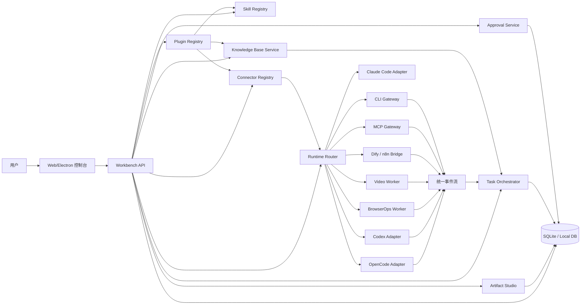
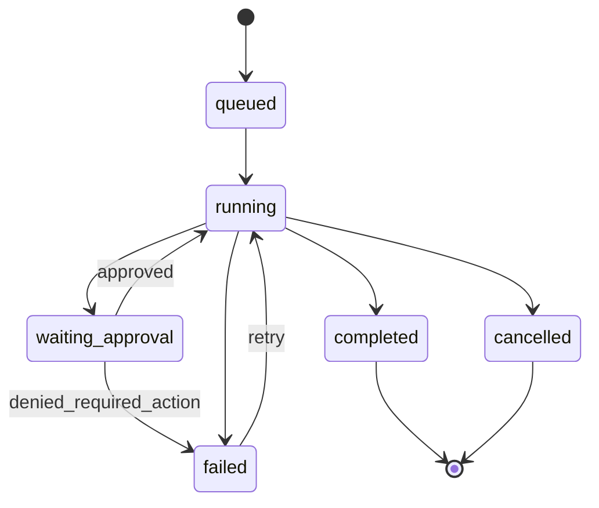

# 产品架构方案

> 文档定位：本文保留产品目标和中长期架构蓝图。当前已经落地的模块边界、执行管线和限制以[当前架构概览](architecture-summary.md)、[Harness 重构说明](harness-refactor.md)和[后端 API](../technical/backend-api.md)为准。

## 当前实现基线（2026-08-24）

- 前端已收敛为 `src/app/session-app.tsx`：Session rail、Composer、Execution stream 与 Details；高级能力统一放入 Settings。
- 已删除自动 Static Local、内置假数据和十个一级管理页面，前端状态只来自本地 API 与 SSE。
- 后端入口与应用装配分离，schema、statements、row mapper、services、transport、plugins 和 connector providers 已模块化。
- Runtime/Catalog 使用 Harness plugin 注册；CLI/MCP 使用 Connector Provider Registry 注册。
- Capability 执行统一经过 Policy → Approval → Provider，并支持审批后从 SQLite 恢复待执行调用。
- Run Event 持久化到 SQLite，通过 JSON/SSE 向运行控制台和审计视图提供同一事件流。
- 本文中的远程 Runner Pool、多用户 Control Plane、完整 Runtime Worker 等仍属于后续蓝图。

## 1. 架构目标

Agent Workbench 的架构目标是把不同 Agent 执行器统一纳入一个可观测、可审批、可扩展的工作台，而不是将所有能力写入一个单体进程。

核心原则：

1. 控制台负责管理、调度、审批、存储和观察。
2. Runtime adapter 负责屏蔽不同 Agent 的协议差异。
3. Worker 负责具体执行，包括编码、浏览器、视频、运营自动化。
4. Skills、MCP 和 CLI 是能力扩展层，必须声明权限、依赖和风险等级。
5. 所有高风险操作先进入审批与审计。
6. 团队知识库是 Agent 的可信上下文来源，必须支持引用、版本、权限和检索范围。
7. Workflow Plugin 是业务流程分发单元，负责把 skill、MCP、CLI、知识范围、输入表单和产物类型组合成可复用任务。
8. Artifact-first：所有重要输出都落盘为 artifact，并通过 manifest 记录来源、版本、知识引用和审批历史。

## 2. 总体架构



## 3. 进程模型

### MVP 本地单机模式

| 进程 | 职责 |
| --- | --- |
| Workbench App | UI、API、SQLite、任务调度、审批 |
| Runtime Worker | OpenCode/Codex/BrowserOps/Video 等执行器 |
| MCP Server | 外部工具，如 GitHub、文件、浏览器、飞书 |
| CLI Connector | 受控命令行能力，如 pnpm、gh、ffmpeg、内部脚本 |

### 后续团队模式

| 服务 | 职责 |
| --- | --- |
| Control Plane | 用户、项目、Agent、策略、审计 |
| Runner Pool | 隔离执行任务 |
| Artifact Service | 资产与版本 |
| Secrets Service | 密钥管理 |
| Realtime Gateway | WebSocket/SSE 事件推送 |

## 4. 核心模块

### 4.1 Workbench UI

职责：

- 任务创建与运行查看
- Agent 与 Team 管理
- Skill 管理
- 团队知识库管理
- MCP/CLI 连接器管理
- 审批弹窗
- 运行日志与指标
- 资产预览

技术建议：

- MVP：React + Vite + SQLite 后端，或 Electron + React
- 后续：Next.js / Remix + API server

### 4.2 Task Orchestrator

职责：

- 创建 task/run/turn
- 调度 Agent 或 Agent Team
- 维护任务状态机
- 聚合 runtime event
- 处理失败、重试、继续

状态机：



### 4.3 Runtime Router

职责：

- 根据 task.agent.runtime 选择 adapter
- 将不同 adapter 事件转换为统一事件
- 中断、恢复、审批响应
- runtime health check
- runtime capability negotiation：streaming、resume、native skill、surgical edit、permission mode
- adapter fallback：首选 runtime 失败后提示用户切换，而不是静默切换

统一接口：

```ts
interface AgentRuntime {
  id: string;
  kind: "coding" | "browser" | "workflow" | "media" | "custom";
  startRun(input: StartRunInput): AsyncIterable<RuntimeEvent>;
  continueRun(input: ContinueRunInput): AsyncIterable<RuntimeEvent>;
  stopRun(runId: string): Promise<void>;
  respondApproval(requestId: string, decision: ApprovalDecision): Promise<void>;
  getStatus(): Promise<RuntimeStatus>;
}
```

Runtime adapter 推荐采用统一接口：

```ts
interface RuntimeAdapter {
  id: string;
  displayName: string;
  detect(): Promise<RuntimeDetection | null>;
  capabilities(): RuntimeCapabilities;
  run(input: RuntimeRunInput): AsyncIterable<RuntimeEvent>;
  cancel(runId: string): Promise<void>;
  resume?(runId: string, message: string): AsyncIterable<RuntimeEvent>;
}
```

这吸收 Open Design 的 adapter-first 思路：Workbench 不重新实现模型调用、上下文压缩、工具循环和权限细节，而是用 adapter 包装成熟 CLI 或 worker。

### 4.4 Knowledge Base Service

职责：

- 管理团队和项目知识库
- 导入 Markdown、PDF、网页、表格摘要、会议纪要
- 建立索引和检索范围
- 记录来源、作者、更新时间、引用次数
- 为 Agent 提供带引用的上下文片段
- 支持知识审核、过期提醒和冲突检测

知识检索输出：

```ts
type KnowledgeHit = {
  itemId: string;
  title: string;
  excerpt: string;
  sourceUrl?: string;
  updatedAt: string;
  confidence: number;
  citation: string;
};
```

### 4.5 Connector Registry

职责：

- 管理 MCP servers
- 管理 CLI command templates
- 记录 env、secret 引用、allowlist 和风险等级
- 提供健康检查和测试调用
- 控制 Agent 可见的工具范围

CLI 连接器不是任意 shell。MVP 只执行登记过的 command template，并通过 JSON schema 限定参数。

### 4.6 Skill Registry

职责：

- 扫描 skills
- 解析 `SKILL.md` 与 `skill.json`
- 校验权限声明
- 依赖安装与自检
- 版本与来源管理

推荐 skill manifest：

```json
{
  "id": "web-access",
  "name": "Web Access",
  "version": "2.5.3",
  "description": "Browser and web automation",
  "entry": "SKILL.md",
  "permissions": ["network", "browser", "files:read"],
  "risk": "medium",
  "dependencies": {
    "node": ">=22"
  }
}
```

### 4.6.1 Plugin Registry

Plugin Registry 管理 workflow plugin。Plugin 不是传统 UI 插件，而是可执行业务流程包。

推荐目录：

```text
plugins/
  weekly-media-post/
    SKILL.md
    plugin.json
    assets/
    examples/
```

推荐 manifest：

```json
{
  "id": "weekly-media-post",
  "version": "0.1.0",
  "scenario": "content",
  "inputsSchema": {"type": "object"},
  "pipeline": ["discovery", "plan", "generate", "critique", "handoff"],
  "requires": {
    "skills": ["web-access", "content-planner"],
    "mcpTools": ["filesystem.read"],
    "cliCommands": ["ffmpeg_render"],
    "knowledgeScopes": ["brand", "platform_rules"]
  },
  "capabilities": ["network:read", "files:write", "mcp:read", "cli:run"]
}
```

Plugin 启动流程：

1. 解析 manifest。
2. 检查依赖和健康状态。
3. 生成 capability gate。
4. 用户授权后创建 task/run。
5. Orchestrator 按 pipeline 注入 stage context。
6. 产物写入 Artifact Service 并记录 provenance。

### 4.7 Approval Service

职责：

- 接收 runtime 的高风险动作请求
- 按策略判断自动允许或人工审批
- 将审批决定回传 runtime
- 写入审计日志

审批类型：

- shell command
- CLI command
- MCP write tool
- file write / delete
- browser submit / publish
- external API mutation
- secret access
- install dependency
- network access to unknown domain

### 4.8 Artifact Service

职责：

- 收集任务产物
- 生成预览
- 关联 task/run/agent
- 支持发布包导出

资产类型：

- markdown
- image
- video
- spreadsheet
- code diff
- browser capture
- publish package
- knowledge export
- connector diagnostics

Artifact manifest：

```ts
type ArtifactManifest = {
  artifactId: string;
  projectId: string;
  taskId: string;
  runId: string;
  type: "markdown" | "html" | "image" | "video" | "ppt" | "diff" | "package";
  name: string;
  sourceAgentId: string;
  sourcePluginId?: string;
  parentArtifactId?: string;
  knowledgeReferenceIds: string[];
  contractVersions: Record<string, string>;
  exportFormats: string[];
};
```

## 5. Runtime Adapter 设计

### OpenCode Adapter

用途：

- 代码修改
- 测试执行
- PR 摘要
- 代码审查

优先接入方式：

1. 如果 OpenCode 提供稳定 server/API，优先使用。
2. 若无稳定 API，再用 CLI JSON event。
3. 最后才解析纯文本输出。

### BrowserOps Worker

用途：

- 打开网页
- 获取登录态内容
- 平台发布前填表
- 运营数据抓取

要求：

- 独立浏览器 profile
- 账号授权隔离
- 发布/提交动作必须审批
- 截图和 DOM 采样进入 artifact

### MCP Gateway

用途：

- 统一连接 stdio / SSE / HTTP MCP server
- 读取 tool list
- 处理 tool call、超时、错误和返回值
- 将 MCP 调用转为统一 `tool.started` / `tool.completed` 事件

要求：

- 每个 Agent 只看到绑定的 MCP tools。
- 写操作或未知风险 tool 默认进入审批。
- MCP server 的 env secret 仅运行时注入，不写入 prompt。

### CLI Gateway

用途：

- 执行项目注册的 command template
- 限定参数 schema、cwd、env、timeout
- 解析 text/json/diff/junit 等输出

要求：

- 不提供无限制 shell 给 Agent。
- 高风险命令需要审批。
- 命令模板和参数进入审计日志。

### Video Worker

用途：

- 短视频脚本
- TTS
- 画面素材生成
- HTML composition 渲染

可借鉴 CyberCode 的 HyperFrames skill pack，但 worker 需要独立安全策略。

## 6. 统一事件协议

```ts
type RuntimeEvent =
  | { type: "run.started"; runId: string; taskId: string; runtimeId: string }
  | { type: "knowledge.retrieved"; runId: string; hits: KnowledgeHit[] }
  | { type: "message.delta"; runId: string; role: "assistant"; text: string }
  | { type: "message.completed"; runId: string; messageId: string; text: string }
  | { type: "tool.started"; runId: string; toolCallId: string; name: string; input: unknown }
  | { type: "tool.completed"; runId: string; toolCallId: string; output: unknown; isError?: boolean }
  | { type: "approval.requested"; runId: string; request: ApprovalRequest }
  | { type: "artifact.created"; runId: string; artifact: ArtifactRef }
  | { type: "metric.updated"; runId: string; metric: RuntimeMetric }
  | { type: "run.completed"; runId: string }
  | { type: "run.failed"; runId: string; error: string }
  | { type: "run.cancelled"; runId: string };
```

## 7. 技术选型建议

### MVP

| 层 | 技术 |
| --- | --- |
| UI | React + Vite |
| Desktop | Electron，可后置 |
| API | Node.js Fastify / Hono |
| DB | SQLite + Drizzle ORM |
| Realtime | SSE |
| Worker 通信 | HTTP + SSE |
| Coding runtime | OpenCode / Codex |
| Browser runtime | Playwright / CDP worker |
| Skill | Markdown + JSON manifest |
| Knowledge | SQLite FTS first，后续向量索引 |
| MCP | stdio / SSE / HTTP gateway |
| CLI | command template + JSON schema |

### 后续

| 层 | 技术 |
| --- | --- |
| Queue | BullMQ / Temporal |
| Secrets | OS keychain / Vault |
| Runner isolation | Docker / Firecracker / sandbox-exec |
| Team auth | OIDC + RBAC |
| Observability | OpenTelemetry |

## 8. 目录结构建议

```text
agent-workbench/
  apps/
    desktop/
    web/
  packages/
    core/
    runtime-protocol/
    skill-registry/
    knowledge-base/
    connector-registry/
    approval-engine/
    artifact-store/
    ui/
  workers/
    opencode-worker/
    browserops-worker/
    video-worker/
    mcp-gateway/
    cli-gateway/
  skills/
    content-planner/
    article-writer/
    web-access/
  docs/
```
