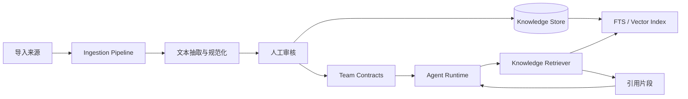
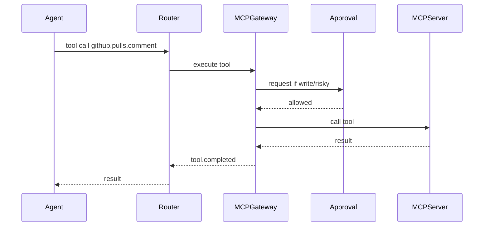

# 团队知识库与 MCP/CLI 架构细化

## 1. 团队知识库架构



## 2. 检索策略

MVP 使用 SQLite FTS：

- 简单、可本地运行
- 易调试
- 适合项目 SOP、品牌规范、决策记录

后续增加向量检索：

- 适合长文档和语义搜索
- 需要 embedding 模型和索引更新策略

推荐组合：

1. 先按 Agent 绑定范围过滤 knowledge base。
2. 按状态过滤，只检索 reviewed，draft 不进入默认上下文。
3. FTS 或向量召回。
4. 按更新时间、可信度、标签匹配重排。
5. 返回 `KnowledgeHit[]`，包含 citation。

## 2.1 团队契约文件

知识库负责“检索”，契约文件负责“约束”。推荐将高频稳定规则沉淀为：

| 文件 | 内容 |
| --- | --- |
| `BRAND.md` | 品牌视觉、语气、组件、反模式 |
| `CONTENT.md` | 账号定位、栏目、标题、禁用表达、平台格式 |
| `WORKFLOW.md` | SOP、审批节点、产物标准 |
| `DECISIONS.md` | 重要技术和产品决策 |

Agent 运行时按项目和 plugin 绑定关系注入契约摘要。Artifact manifest 记录契约版本，便于回溯为什么当时产物采用某种风格或表达。

## 3. MCP Gateway

MCP Gateway 负责把多个 MCP server 统一暴露为可审批工具。



## 4. CLI Gateway

CLI Gateway 不提供任意 shell，而是执行项目注册的模板。

```json
{
  "id": "cli_pnpm_build",
  "commandTemplate": "pnpm build",
  "argsSchema": {"type": "object", "properties": {}},
  "cwdPolicy": "project_root",
  "timeoutMs": 120000,
  "risk": "low"
}
```

命令执行流程：

1. Agent 请求调用 CLI。
2. Gateway 检查 Agent 是否绑定该命令。
3. 参数通过 schema 校验。
4. 根据 risk 和 policy 判断是否审批。
5. 执行命令并收集 stdout/stderr/exit code。
6. 生成 tool result 和审计记录。

## 5. 与 Skills 的关系

Skills 是“能力说明和工作流知识”，MCP/CLI 是“可调用工具”。

三者关系：

- Skill 可以声明依赖某些 MCP tools 或 CLI commands。
- Agent 可以直接绑定 MCP/CLI，不必通过 skill 间接使用。
- UI 必须分别管理 Skill、MCP、CLI 的启用状态和风险。

## 6. 与 Workflow Plugin 的关系

Workflow Plugin 是更高层的业务包：

- Plugin 引用一个或多个 skills。
- Plugin 声明默认知识范围和契约文件。
- Plugin 声明需要的 MCP tools 与 CLI commands。
- Plugin 启动前生成 capability gate。
- Plugin 运行后将产物、知识引用、契约版本写入 artifact manifest。
