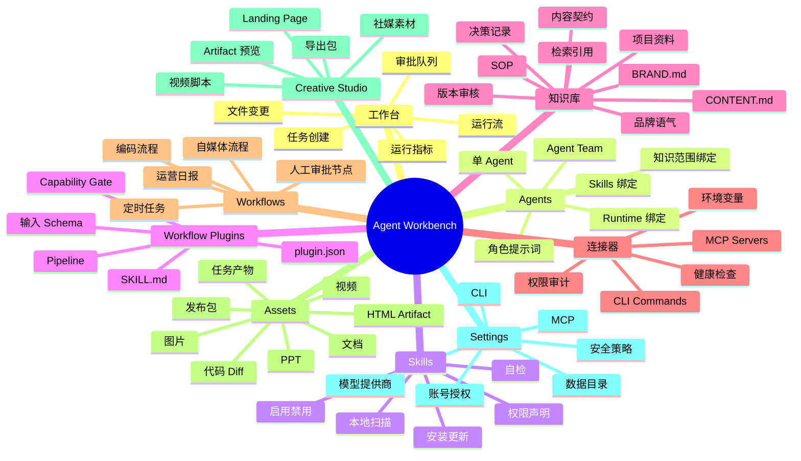
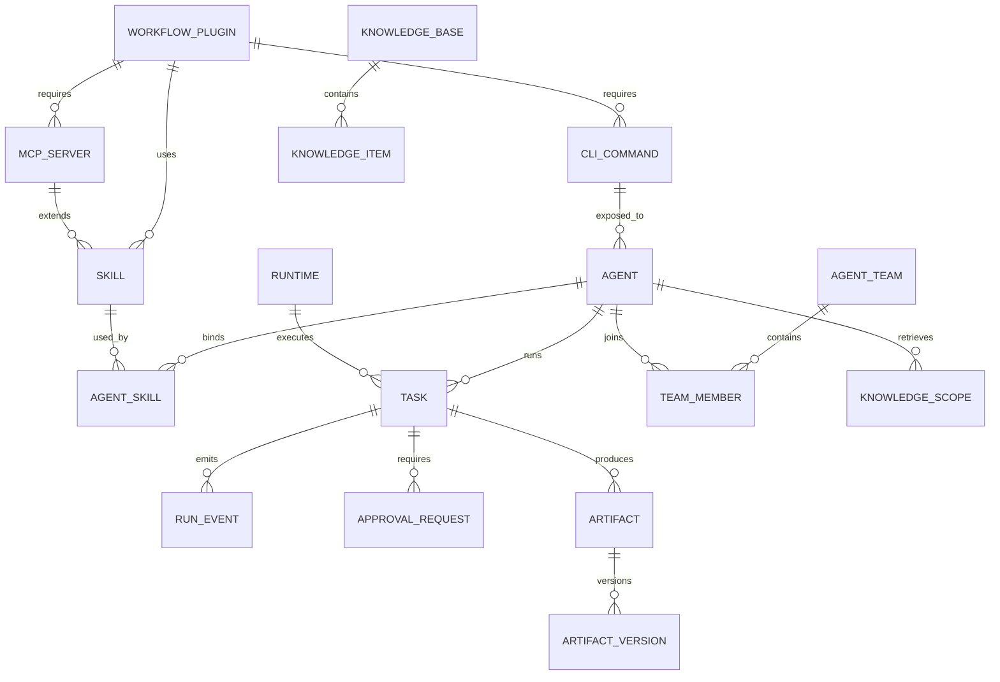

# 功能地图

## MVP 功能分层

## Runtime 能力矩阵

| Runtime | 主要用途 | 接入方式 | MVP |
| --- | --- | --- | --- |
| OpenCode | 编码、代码审查、测试 | CLI / server / plugin | 是 |
| Codex | 编码、本地任务、文件变更 | CLI / app-server / JSON-RPC | 可选 |
| GenericAgent worker | 浏览器操作、运营任务 | HTTP/SSE worker | 是 |
| CyberCode-style worker | 视频、轻量内容生成 | HTTP/SSE worker | 否，作为实验 |
| Open Design-inspired creative runtime | 设计、PPT、网页、图片、视频脚本产物 | Workflow plugin / artifact preview / CLI | P1 |
| Dify / n8n | 固定流程自动化 | HTTP API / webhook | P1 |
| MCP server | 工具扩展 | stdio / SSE / HTTP | 是 |
| CLI connector | 复用本地命令行能力 | command template / JSON schema | 是 |

## 核心对象关系

